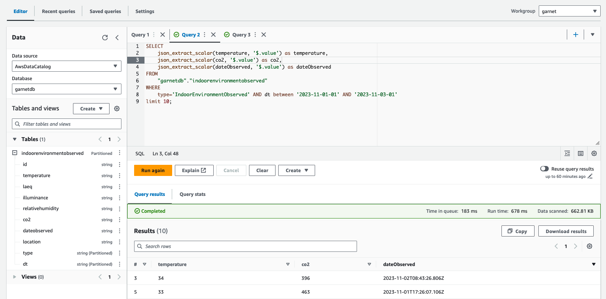

# Garnet Framework - Examples of Data Producers and Data Consumers

This repository contains examples of CDK applications that deploy stacks of Data Producers and Data Consumers. More examples will be added over time. 

To learn about the Garnet Framework, explore the [documentation website of Garnet Framework](https://garnet-framework.dev/docs) to get started. 

You can select the stacks you want to deploy in this [file](/bin/garnet-dx-examples.ts). 

## Deploy the CDK stacks

You can select the region in which you want to deploy the CDK stacks in the [parameters](/parameters.ts) file.

Once you selected the stacks to deploy, you can deploy them using the following commands: 

```bash 
npm install 
```

If you haven't yet bootstrapped your environment for CDK, you can do it with: 

```bash
cdk bootstrap
```

Finally you can deploy all the stacks: 

```bash
cdk deploy --all
```

## Data Producers examples 

In the context of Garnet, Data producers are components that ingest data from a data source and convert it into NGSI-LD entities before pushing them to Garnet. 

We can break down a Garnet Data Producer into two steps. 

The first step is to ingest the data from the source. This depends on the technology of the data source and its interface. For example, you could use [AWS IoT Core for LoRaWAN](https://www.youtube.com/watch?v=6-ZrdRjqdTk) to ingest data from LoRaWAN sensors or you could [schedule a Lambda function using EventBridge](https://docs.aws.amazon.com/eventbridge/latest/userguide/eb-run-lambda-schedule.html) to fetch data from an existing API.

Once the data is ingested, the second step is to convert the data into NGSI-LD entities. You can use the [Smart Data Models](https://smartdatamodels.org/) initiative to select NGSI-LD compliant data models that fit your use cases. 

Once the data is converted, you can then publish the entities into the Amazon SQS Queue of the Garnet IoT module.

### Using AWS IoT Core for LoRaWAN

Visit the [documentation website](https://garnet-framework.dev/docs/smart-solutions/data-producers/#using-aws-iot-core-for-lorawan) for more information. 

You can find an [example](/lib/stacks/garnet-dp-stacks/garnet-dp-aicl/garnet-dp-aicl.ts) of a CDK stack of a Data Producer to ingest data from LoRaWAN sensors using AWS IoT Core for LoRaWAN and publishes to Garnet.

You can deploy this stack multiple times for all the LoRaWAN sensors you want to connect. To deploy a stack you need to provide the prefix of the thing that will be registered as a Thing in the Garnet Registry. We provide samples for some sensors (see the list above).

The name of the decoding function to use is extracted from the thing_prefix used. 
For example, if you use the prefix `IndoorEnvironment-AM103`, the stack will extract the last part of the prefix in lower case `am103` and will use the Lambda in the folder with the same name `am103`. 

#### List of sensors 

We provide ready-to-use stacks for a [list](/lib/stacks/garnet-dp-stacks/garnet-dp-aicl/lambda/) of sensors. The list below will be updated over time.

- Indoor Environment Monitoring using [Milesight AM103](https://www.milesight-iot.com/lorawan/sensor/am103/). The sensor measures co2, temperature and relative humidity.
- Indoor Environment Monitoring using [Elsys ERS Sound](https://www.elsys.se/en/ers-sound/). The sensor measures illuminance, noise level, temperature and relative humidity.
- Indoor Environment Monitoring using [SenseCAP S2103](https://www.seeedstudio.com/SenseCAP-S2103-LoRaWAN-CO2-Temperature-and-Humidity-Sensor-p-5356.html). The sensor measures co2, temperature and relative humidity.

## Data Consumer examples 

Garnet offers multiple ways to consume the data. You can use the Garnet API to [query the FIWARE Context Broker](https://garnet-framework.dev/docs/how/context-broker#query-entities) and the [Garnet IoT Registry](https://garnet-framework.dev/docs/how/garnet-iot#query-a-thing). You can build an API to query the Garnet Data Lake for historical data. You can also subscribe to all changes of named shadows making it easier to build real-time applications.

Finally, you can create subscriptions in the Context Broker to notify independent systems and applications. Using the Garnet Private Endpoint for Subscriptions, you can subscribe to notifications using the AWS IoT Core MQTT Broker and use AWS IoT Rules to route and process the notifications.

For example, you can use the Garnet Private Endpoint for Subscriptions to create a subscription to be notified of all entities of type ParkingSpot located in a specified area and then subscribe to the subscription MQTT topic in your web or mobile application using Amplify to get in near real time the parking space availability.

In addition, you can use Amazon Athena to query and analyze the historical data stored in the Garnet datalake. You can then use Amazon Quicksight or Grafana to visualise your data and build dashboards.

### Using Amazon Athena to query the datalake

Visit the [documentation website](https://garnet-framework.dev/docs/smart-solutions/data-consumers/#using-amazon-athena-to-query-the-datalake) for more information. 

You can find an [example](/lib/stacks/garnet-dc-stacks/garnet-dc-athena/garnet-dc-athena.ts) of a CDK stack that creates a table for querying the data from the Garnet data lake. This table is created using the schema defined in the file [athena-schema.ts](/athena-schema.ts). You can deploy this stack multiple times using different schemas. 

In that case, we create a table for entities of type [`IndoorEnvironmentObserved`](https://github.com/smart-data-models/dataModel.Environment/blob/master/IndoorEnvironmentObserved/README.md). Note that we also use properties from the [AirQualityObserved](https://github.com/smart-data-models/dataModel.Environment/tree/master/AirQualityObserved) model. 
To deploy this stack, you must provide the type of your entities (as stored in the Garnet Data Lake).

Once deployed, you can then query your data using Athena. 

<br>



<br>

## Security

See [CONTRIBUTING](CONTRIBUTING.md#security-issue-notifications) for more information.

## License

This library is licensed under the MIT-0 License. See the LICENSE file.

